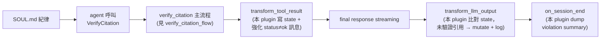

# citation-guard plugin 流程圖（Activity Diagram）

對應設計紅線#2「Citation verification 是必要防線」的 enforcement 路徑。工具層的內部流程不在本頁，請見 [[verify_citation_flow]]。

相關頁面：[[../citation-guard-plugin]]、[[../verify-citation]]、[[verify_citation_flow]]、[[legal_kb_flow]]、[[../map]]

> **圖表閱讀規則**
> - 節點以中文敘述為主，英文僅保留必要的程式識別字（hook 名、欄位名、檔名）
> - 判斷節點以「是 / 否」分支
> - 圖下附「節點對照」中文逐步說明，以圖為輔、以中文為主

---

## 1. 跨 turn 全景：四層 enforcement

```mermaid
graph TD
    Q(["使用者法律問題"]) --> SOUL["事前紀律：SOUL.md<br/>『法務情境引用法條的紀律』<br/>要求引用前先呼叫 verify_citation"]
    SOUL --> Loop["agent main tool loop<br/>(run_agent.py)"]
    Loop --> Tool{"agent 是否呼叫<br/>VerifyCitation?"}
    Tool -- 否 --> NoVerify["state 不記錄"]
    Tool -- 是 --> ToolDispatch["registry.dispatch<br/>→ tools.verify_citation 主流程<br/>(見 verify_citation_flow)"]
    ToolDispatch --> TTR["事中強化：<br/>transform_tool_result hook<br/>(_on_transform_tool_result)"]
    TTR --> RecordState["寫 per-session state：<br/>(law_name, normalized_no) → status"]
    RecordState --> StatusOk{"status == ok?"}
    StatusOk -- 是 --> RetNone["return None<br/>(不修改 result)"]
    StatusOk -- 否 --> Reinforce["return 強化版 result：<br/>『Citation guard』警語 +<br/>原 result(含 ground truth)"]
    RetNone --> NextIter["LLM 看到 result 進入下一輪迭代"]
    Reinforce --> NextIter
    NoVerify --> NextIter
    NextIter --> FinalIter{"本輪是 final 迭代?<br/>(無 tool_calls，<br/>finish_reason=end_turn)"}
    FinalIter -- 否 --> Loop
    FinalIter -- 是 --> Stream["LLM 開始 streaming<br/>final response 給 user"]
    Stream --> TLO["事後兜底：<br/>transform_llm_output hook<br/>(streaming 結束後 post-hoc)"]
    TLO --> Extract["_extract_citations<br/>parse 三型法條引用<br/>+ 條號 normalize"]
    Extract --> AnyCite{"有 citation?"}
    AnyCite -- 否 --> PassThrough["return None<br/>(不修改 final response)"]
    AnyCite -- 是 --> Compare["逐個比對 per-session state"]
    Compare --> AllOk{"全部都<br/>verified ok?"}
    AllOk -- 是 --> PassThrough
    AllOk -- 否 --> Mutate["mutate response：<br/>『[Citation guard] 偵測到<br/>未驗證引用，原回答已攔截』"]
    Mutate --> WriteLog["append jsonl：<br/>citation_violations/<br/>&lt;YYYYMMDD&gt;.jsonl<br/>(type=violation)"]
    WriteLog --> Deliver
    PassThrough --> Deliver["回應送 user / 寫入 stored copy"]
    Deliver --> SE["Audit：<br/>on_session_end hook"]
    SE --> Drain["_drain_state(session_id)<br/>取本 session 所有<br/>verify 紀錄"]
    Drain --> Empty{"有 verify 紀錄?"}
    Empty -- 否 --> End(["session 結束"])
    Empty -- 是 --> WriteSummary["append jsonl 同檔：<br/>type=session_summary<br/>verify_calls / verify_ok /<br/>violation_rate"]
    WriteSummary --> End
```

### 節點對照（中文逐步）

| 節點 | 說明 |
|---|---|
| **Q 使用者法律問題** | 對話起點；本圖只關心法務 / 引用情境 |
| **SOUL 事前紀律** | `.hermes/SOUL.md` 紀律段告訴 agent 法務情境必須先 `verify_citation`；提升 first-pass 配合率 |
| **Loop main tool loop** | hermes-agent v0.13 主迴圈（`run_agent.py`） |
| **Tool 是否呼叫 VerifyCitation?** | 配合 SOUL.md → 是；偏離 SOUL.md → 否（走 NoVerify 直奔 final） |
| **ToolDispatch dispatch** | `registry.dispatch("VerifyCitation", ...)` 進入 `tools/verify_citation.py` 主流程 |
| **TTR transform_tool_result hook** | hermes 在 `model_tools.py:794-811` post tool dispatch 觸發；本 plugin 在此截 result |
| **RecordState 寫 state** | 鍵 `(law_name, normalized_article_no)` → `status`；bucket key = `task_id or session_id or "default"` |
| **StatusOk status==ok?** | 是 → 不修改；否（`law_not_found` / `article_not_found` / `content_mismatch`）→ 強化 result |
| **Reinforce 強化 result** | 拼上『[Citation guard] verify_citation 回傳 status=…；務必使用下方 ground truth 修正引用…』+ 原 result（含 ground truth `article_content`），讓下一輪 LLM 一眼就懂要修 |
| **NextIter 下一輪迭代** | LLM 收到（強化或原版）result，繼續 reasoning / 呼叫工具 |
| **FinalIter final 迭代?** | 無 tool_calls + finish_reason=end_turn → 本輪是 final，準備 streaming；否則繼續 loop |
| **Stream streaming final** | hermes 把 final response chunks 推 user；中間迭代的 `text_delta` 早被抑制（`run_agent.py:7362-7365`），這裡才是首次見光 |
| **TLO transform_llm_output hook** | streaming 結束後在 `run_agent.py:14562-14575` 觸發；可 mutate 整段 final response 字串、不能 block |
| **Extract 三型 parse + normalize** | regex 匹配 `《XX法》第 N 條` / `XX法第 N 條` / `XX法 第 N 條`，套 `_trim_law_prefix` 裁掉常見動詞前綴，再過 `_try_normalize` 統一條號鍵 |
| **AnyCite 有 citation?** | 沒 citation → 不關 plugin 的事，pass-through |
| **Compare 比對 state** | 對每個 `(law_name, normalized_no)` 查 bucket：找不到 → `unverified`；找到但 status 非 `ok` → 失敗 |
| **AllOk 全部都 ok?** | 是 → return None；否 → 走 mutate 路徑 |
| **Mutate 攔截原回答** | 替換成『[Citation guard] 偵測到未驗證引用，原回答已攔截』+ 違規清單；TUI / web frontend re-render 後 user 看到的是 mutate 版 |
| **WriteLog 寫 violation jsonl** | `$HERMES_HOME/logs/citation_violations/<YYYYMMDD>.jsonl`；`type="violation"` |
| **SE on_session_end hook** | `run_agent.py:14694-14708` 每次 `run_conversation` 結束觸發 |
| **Drain 結算 state** | `_drain_state("", session_id)` pop 該 session bucket |
| **WriteSummary 寫 summary jsonl** | 同檔不同 type：`type="session_summary"`，欄位 `verify_calls` / `verify_ok` / `violation_rate` |
| **End session 結束** | 進程記憶體中的 state 已被 drain，下個 session 重新開始 |

### 關鍵不變式

- **本 plugin 不動 core**：三 hook 全走 `hermes_cli/plugins.py:VALID_HOOKS` 既有 contract，對齊紅線#3
- **state 鎖在 process memory**：`_lock` 保護並發 hook；不寫 disk，session 結束就收掉
- **violation log 鎖在 HERMES_HOME**：`$HERMES_HOME/logs/citation_violations/`；對齊紅線#4
- **streaming 期間有短暫洩漏窗口**：`transform_llm_output` 是 post-hoc，對偏離 SOUL.md 的 agent 仍可能讓 user 看到 partial chunks；spec §「此方案的誠實限制」明訂，本圖以「Stream → TLO」順序呈現
- **`transform_tool_result` 限 `tool_name="VerifyCitation"`**：避免污染其他工具 result；且本 plugin 對 `legal_kb` 其餘工具完全唯讀

---

## 2. 與 verify_citation 工具流程的銜接

| 節點 | 說明 |
|---|---|
| **SOUL.md 紀律** | 第一層 enforcement，提升 first-pass 配合率 |
| **VerifyCitation 主流程** | 工具層責任，本圖不展開 |
| **TTR 事中強化** | 截 result、寫 state、status 非 ok 強化訊息 |
| **TLO 事後兜底** | parse 引用、比對 state、未驗證 mutate + log |
| **SE Audit** | session 級驗證統計 dump 到同 jsonl |

---

## 維護規則

- 動到 `.hermes/plugins/citation-guard/__init__.py` 三 hook 行為時回來更新本圖與 [[../citation-guard-plugin]]
- 動 hermes-agent v0.13 的 hook 觸發點 / signature 也回來更新（以 `hermes_cli/plugins.py` + `run_agent.py` + `model_tools.py` 為唯一真理）
- 若未來 spec §「動 core 的硬 enforcement 選項」拍板啟動，本 plugin 的「事後兜底」可能改為純 audit，新流程另開新檔；本圖維持「不動 core 路線」現狀
- 語言規則同 [[legal_kb_flow]]：中文為主、「是 / 否」判斷、附對照表
