# MOJ KB Pipeline 階段 C 活動圖

階段 C 把 MOJ KB pipeline 接到 hermes 內建 cron + Telegram + dashboard plugin。
分兩條路徑：

- **路徑 1**：cron tick → 喚醒 agent → 寫 scan dump → 推 Telegram
- **路徑 2**：使用者點連結 → dashboard 展開 → 勾選 → confirm → KB 更新

> **圖表閱讀規則**
> - 節點以中文敘述為主，英文僅保留必要的程式識別字（檔名、hook 名、API 端點）
> - 判斷節點以「是/否」分支
> - 節點對照表呈現完整的中文敘述

```mermaid
flowchart TD
    %% 路徑 1：cron 觸發 → scan dump → Telegram
    A[cron tick 60 秒一次] --> B{是否有到期 cron job？}
    B -->|否| A
    B -->|是| C[喚醒 AIAgent 一輪對話<br/>enabled_toolsets=legal_kb]
    C --> D[agent 呼叫 RunDownloadAndScan 工具]
    D --> E[run_download_and_scan：<br/>moj_kb_download.download → scan_law_changes]
    E --> F{下載成功 + scan 完成？}
    F -->|否| G[拋例外，cron 收到 error<br/>deliver 推錯誤訊息]
    F -->|是| H[scan dump 落檔<br/>HERMES_HOME/legal_kb_scans/&#123;scan_id&#125;.json]
    H --> I[agent 寫摘要：new/changed/obsolete 數量<br/>內嵌 dashboard?scan_id 連結]
    I --> J[deliver=telegram 推 Telegram 主頻道]

    %% 路徑 2：使用者 → dashboard → confirm/cancel
    J --> K[使用者收到 Telegram 訊息]
    K --> L[點 dashboard 連結]
    L --> M[panel 載入 + 自動展開該 scan]
    M --> N[GET /scans/&#123;id&#125; 拿完整 scan]
    N --> O{使用者要做什麼？}
    O -->|套用選定| P[勾選法規 + 是否刪 obsolete<br/>POST /scans/&#123;id&#125;/confirm]
    O -->|取消此 scan| Q[POST /scans/&#123;id&#125;/cancel]
    O -->|不處理| R[scan 檔留著，下次再看]

    P --> S[run_apply_selected：<br/>filter laws → apply_extraction → generate_summaries]
    S --> T{apply 成功？}
    T -->|否| U[500 + traceback，UI 顯示錯誤<br/>scan 檔保留供重試]
    T -->|是| V[KB 檔更新<br/>law_list.txt / index.json 更新<br/>extract_*.json 寫入]
    V --> W[scan 檔被刪]
    W --> X[UI refresh：scan 列表收回<br/>history panel 新增條目]

    Q --> Y[scan 檔被刪]
    Y --> Z[UI refresh：scan 列表收回<br/>history panel 不變]
```

**節點對照表**

| 節點 | 中文敘述 |
|---|---|
| A | hermes-agent/gateway 內 cron daemon 每 60 秒掃一次 |
| B | 是否有到期 cron job（schedule 條件達成） |
| C | 為 cron job 啟一輪 AIAgent 對話，限制可用 toolset 為 legal_kb |
| D | agent 依 prompt 呼叫工具；只允許 RunDownloadAndScan，不允許 apply |
| E | 純函式 run_download_and_scan：下載 + diff |
| F | 下載 / scan 流程是否完整成功 |
| G | 例外往上拋，cron `_deliver_result` 推錯誤訊息給 Telegram |
| H | scan dump 落到 HERMES_HOME 下（runtime 狀態，不入 git） |
| I | agent 將 summary + dashboard 連結（含 scan_id query）寫進回應 |
| J | cron deliver 機制把 agent 回應推到 Telegram 主頻道 |
| K | 使用者在 Telegram 看到摘要 + 連結 |
| L | 使用者點連結進 dashboard，URL 帶 ?scan_id=xxx |
| M | LegalKBAdminPage 偵測 query，自動展開該 scan 的 ScanRow |
| N | 前端 fetch 完整 scan dump（含 article_diffs） |
| O | 使用者三選一：套用 / 取消 / 不動 |
| P | 勾選法規（預設全選）+ 是否同時刪除 obsolete 法規目錄；按「套用選定」 |
| Q | 直接按「取消此 scan」 |
| R | 不點任何按鈕：scan 檔留在 legal_kb_scans/，下次進 panel 仍會出現 |
| S | run_apply_selected：依勾選 filter scan dict → apply_extraction → generate_summaries |
| T | apply 是否成功 |
| U | 失敗回 500 + traceback；UI 顯示錯誤；scan 檔不刪以利重試 |
| V | KB 真實異動：每部法規 JSON 覆蓋 / 寫入 / 刪除；law_list.txt 與 index.json 重算；extract_*.json 寫進 wiki/legal/logs/change/ |
| W | run_apply_selected 結尾 unlink scan dump |
| X | 前端 onChanged 回呼：refresh scans 與 history 兩個 panel |
| Y | plugin endpoint cancel 直接 unlink scan dump |
| Z | history panel 不變（cancel 不寫 changelog） |

## 紅線檢查

- 路徑 1 中 **agent 不可呼叫 apply**：toolset registry 中無 `RunApply*`，
  只有 read-only 五工具 + `RunDownloadAndScan`
- 路徑 2 中 **apply 必須由人按按鈕**：唯一寫入入口為
  `POST /scans/{id}/confirm`，由使用者在 dashboard 觸發
- scan 檔在 confirm / cancel 後均刪，避免重複套用
- 所有 hermes-agent core 模組（agent/、gateway/、cron/、hermes_cli/ 除既有
  plugin scan logic 外）皆未修改

## 相關 page

- [[legal/legal-kb-admin-plugin]] — plugin 用途、API、scan 檔生命週期、cron job 範例
- [[legal/Activity_diagram/moj_download_flow]] — 下載 + 比對純函式（階段 A/B）
- [[legal/Activity_diagram/legal_kb_flow]] — runtime 五工具進入點
