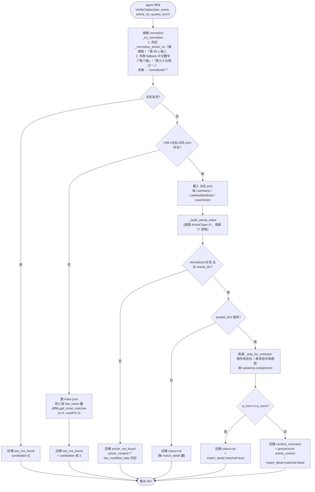
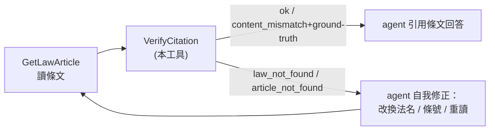

# verify_citation 流程圖（Activity Diagram）

對應設計紅線#2「Citation verification 是必要防線」的工具層流程；不含 enforcement（plugin / SOUL.md）路徑，那部分等 [[citation_guard_flow]]（Stage 2 後落地）。

相關頁面：[[../verify-citation]]、[[legal_kb_flow]]、[[../legal-kb-programs]]、[[../map]]

> **圖表閱讀規則**
> - 節點以中文敘述為主，英文僅保留必要的程式識別字（檔名、函式名、欄位名）
> - 判斷節點以「是 / 否」分支
> - 圖下附「節點對照」中文逐步說明，以圖為輔、以中文為主

---

## 工具內部流程（單次呼叫）

### 節點對照（中文逐步）

| 節點 | 說明 |
|---|---|
| **Start 入口** | agent 呼叫 `VerifyCitation`，傳 `law_name` / `article_no` /（可選）`quoted_text` |
| **Normalize 條號 normalize** | 先試 `_normalize_article_no`（複用自 `tools/legal_kb.py`）接受裸條號與「第 95-1 條」；失敗 fallback 中文數字薄層接受「第八條」/「第九十五條之一」（範圍 1-999 + 附條）；任一失敗 normalized 設為空字串繼續往下走，**不直接退出** |
| **CheckName 法名為空?** | 防呆，空字串直接回 `law_not_found`、`candidates=[]`（無 KB 可 fuzzy） |
| **CheckLaw 法檔存在?** | 走 `<KB>/法名/法名.json` 路徑；命中走主流程，否則進 fuzzy |
| **Fuzzy 讀 index 做 fuzzy** | `read_index()` 拿 `index.json`，**對小寫 `law_name` 鍵** 跑 `difflib.get_close_matches(n=3, cutoff=0.4)`；spec 文字寫成 `LawName` 是 source ChLaw.json 概念欄，KB index 落地是小寫 |
| **ReadDetail 載入 法名.json** | 拿 `LawName`（命中真實法名）/ `LawModifiedDate` / `LawArticles` |
| **BuildIdx 建條索引** | 複用 `_build_article_index`；只篩 `ArticleType='A'`，章節標題 `'C'` 自然被排除（這是「ArticleType 排除」的關鍵不變式） |
| **CheckArt 條號在 index?** | normalize 失敗（normalized 為空）或不在索引 → `article_not_found`；`law_modified_date` 仍回（給 agent 知道法的版本） |
| **CheckQuote quoted_text 提供?** | 沒提供 → 跳過內容比對，直接回 `ok`，**不出 `match_detail` 鍵** |
| **Compare 標準化內容比對** | `_strip_for_compare` = `re.sub(r"\s+", "", ...)` + 移除中英常見標點（句逗、引號、頓號、括號、冒號、分號、問號、驚嘆號等）後做 substring `in` |
| **Matched 命中?** | 命中 → `ok` + `match_detail.matched=true`；未命中 → `content_mismatch` + ground truth `ArticleContent` 回 + `match_detail.matched=false` |
| **Out 輸出** | dict；handler 層（`_verify_citation_handler`）外包 `{"success": True, ...}` JSON 字串給 hermes registry |

### 關鍵不變式

- **任一 status 都回 `article_content`**：失敗時為空字串，命中時為 ground truth；給 agent 自我修正錨點
- **`candidates` 只在 `law_not_found` 出現**；不混入其他 status
- **`match_detail` 只在有 `quoted_text` 時出現**；`quoted_text=None` 完全跳過
- **章節標題（`ArticleType='C'`）絕不會被當條文命中**，由 `_build_article_index` 在源頭篩掉
- **超出範圍中文數字（千 / 萬 / 億）gracefully raise**，由上層 `_try_normalize` except 收成 `normalized=""`，主流程走到 `article_not_found`，**不靜默吃**

---

## 與 legal_kb 流程的銜接

`verify_citation` 是檢索路徑（`GetIndex → GetLawToc → GetLawArticle`）之後、回答之前的閘門。在 [[legal_kb_flow]] 中標示為「TODO：verify_citation（尚未實作）」的虛擬節點，本工具落地後該節點實線化（spec §落地清單 §文件層更新由 Stage 3 統一翻牌）。

| 節點 | 說明 |
|---|---|
| **GLA GetLawArticle 讀條文** | v2 主路徑最後一層；輸出條文 + chapter_header |
| **VC VerifyCitation 本工具** | 在 agent 引用前驗證；任一失敗都回 ground truth 給 retry 用 |
| **Ans 以條文回答** | `ok` 直接走；`content_mismatch` 走時 agent 應改用 ground-truth 而非原引文 |
| **Retry agent 自我修正** | `law_not_found` 用 candidates 改名、`article_not_found` 換條號或先回 `GetLawToc` 找對的條 |

---

## 維護規則

- 動到 `tools/verify_citation.py` 的責任邊界（normalize 規則、內容比對規則、回傳欄位）回來更新本頁
- 加 enforcement 流程（plugin / SOUL.md / `on_session_end` audit）另開新檔 [[citation_guard_flow]]（Stage 2 範圍），不要塞進本頁
- 語言規則同 [[legal_kb_flow]]：中文為主、「是 / 否」判斷、附對照表
