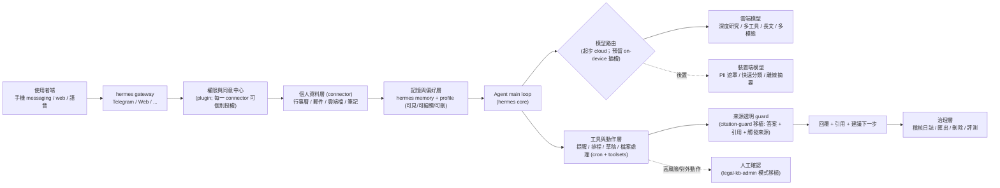

# hermit — 個人化 AI Agent 設計 seed spec

> **狀態：已畢業為 hermit repo 的一線設計文件（single source）** · 本文件原為暫存在 hermes_law repo `docs/spinoff-personal-agent/` 下的種子規格，2026-05-28 隨 P0「專案落地」移到本 repo `docs/seed-spec.md`，並已開始接 hermit 自己的 `wiki/` / `log.md` / `index.md` 紀律。
>
> **來源與限制**：本 seed 綜合 (1) 一份個人化 AI agent 市場調查與需求分析報告（deep research，**公開資料基礎版**），與 (2) hermes_law 已驗證落地的架構模式。報告自述未讀到使用者私有 Google Drive 需求文件，故本 seed 同屬「公開資料基礎版」；私有需求納入後需回頭修訂。

---

## 0. 一句話定位

**不是「另一個更會聊天的 AI」，而是以繁體中文與台灣生活脈絡為核心的「個人知識與任務中樞」**——能持續記住偏好、跨來源整合個人資料、把答案變成可執行的提醒/草稿，且讓使用者看得見依據、控制得了記憶與權限。

差異化窗口在三個交集：**繁中/台灣在地化 × 權限可控的個人資料脈絡 × 從研究到提醒到草稿的閉環執行**。正面比模型能力是紅海；可打的是「在繁中環境下更可信地處理個人任務」。

---

## 1. 與 hermes_law 的關係

| 面向 | 決策 |
|---|---|
| 專案邊界 | **獨立專案、獨立 repo**，與 hermes_law（法務）平行，不是它底下的 vertical |
| 共用什麼 | **同一個 hermes-agent 上游底座** + hermes_law 已驗證的**架構模式**（見 §3） |
| 不共用什麼 | 不共用 running instance；不搬法務資產（`legal_kb`、`citation-guard`、`fsc-penalty-search`、MOJ pipeline 全留在 hermes_law） |
| Runtime | **獨立 OS user**（見 §5.1）：沿用上游預設 `~/.hermes` 與 `~/wiki`，靠 `$HOME` 與法務完全隔離 |

**為什麼獨立而非 vertical**：runtime 狀態、設計紅線、產品 identity 全部切乾淨，個人版不必背法務的 citation 紅線與 KB 維運，法務也不被個人資料 connector 的隱私面複雜度污染。代價是要各自維護一套 HERMES_HOME 與備份鏡像——但 hermes_law 的 design-notes §紅線#4 本來就標了「多個 hermes 專案要並存就切 per-project HERMES_HOME」，這正是觸發點。

---

## 2. 市場前提（承接報告，僅列決策用數據）

| 訊號 | 數值 | 對產品的意義 |
|---|---:|---|
| 台灣 GenAI 使用率 / 付費訂閱率 | 43.19% / 8.54% | 使用面已主流、付費仍早期 → **Freemium 起手**最合理 |
| 台灣曾用 / 自費 / 每日重度 | 46% / 17% / 9% | 已有習慣化族群，但自掏腰包仍少數 |
| 最佳起始族群 | 26–35 歲（自費率最高 ~23%） | 「高頻＋付費＋留存」飛輪最可能在此族群成形 |
| 信任風險感知 | 個資外洩自評影響 36.6%；過半民眾對 AI 日常化更擔心 | **信任是採用門檻、不是加分項** |

商業模式採 **Freemium + 訂閱 + B2B2C 綁定**：免費層導流；個人 Plus 約 **NT$149–249/月**（低於國際旗艦 US$20、高於零售工具 App）；Pro 約 NT$299–499 解鎖代理工作流；B2B2C（電信/金融/教育/裝置）是成長主軸而非可選項（報告指企業/機構代付目前仍高於個人自費）。

---

## 3. 為什麼「可以延用」——底座與模式盤點

### 3.1 hermes-agent 內建能力 → 報告需求

| 報告需求 | hermes 內建 | 延用程度 |
|---|---|---|
| 可控長期記憶 | persistent memory（跨 session、FTS5 搜尋、user profiling） | 直接用（core） |
| 提醒／排程／待辦 | cron scheduler | 直接用（core） |
| 多 persona／角色 | profile 機制（hermes_law 已用 4 種 profile 驗證過） | 直接用 |
| Skill／第三方工具擴充 | skill 學習迴路 + toolsets | 直接用 |
| 多平台入口（行動入口先靠 messaging） | gateway（CLI / Telegram / Signal / WhatsApp / Discord / Slack / Email 共用同一 agent process） | 直接用 |
| 換模型彈性 | model-agnostic（200+ models via OpenRouter / OpenAI / Anthropic） | 直接用 |
| 自製前台（chat + 管理） | `hermes web`（9119 管理 API）+ gateway api_server（8642 OpenAI-compatible chat）+ plugin 掛載機制 | 直接用（前台 SPA + proxy 規格已被 hermes_law 驗證可行） |

### 3.2 hermes_law 已驗證模式 → 移植到個人版

報告把**信任**（記憶可控、來源可引用、權限可控）列為採用門檻——而這套信任機制 hermes_law 已經蓋好，只是綁在「法條」這個來源上。移植即可：

| hermes_law 模式 | 個人版改寫 | 落地形狀 |
|---|---|---|
| `jurisdiction` 是 first-class | **個人情境／領域是 first-class** | 「加一個 context code + 一組 skill + 一份 KB」就能橫向擴（健康/財務/家庭…），不 hardcode |
| `citation-guard` 四層 hook（事前 SOUL／事中／事後／audit） | **來源透明 guard**：研究型回答附引用、個人化回答標觸發來源、記憶引用可追溯 | 同一套 plugin hook 架構，把「權威來源 = 法規 KB」換成「答案依據 = web 來源 / 個人資料源 / memory id」 |
| `legal-kb-admin` 的 machine-proposes-human-confirms | **connector 同意中心 / 高風險動作確認** | 任何「機器自己動了個人資料 / 對外執行」的路徑都要有人按；唯一寫入入口走 plugin |
| HERMES_HOME 狀態集中 + overlay/patches 鏡像備份 | per-project HERMES_HOME + 自己的鏡像備份 | 可攜、可重灌、可版本控制 |
| file-backed deterministic KB（非 vector RAG） | 個人知識/筆記先走 file-backed，RAG 等 pain point 再加 | 與報告「RAG 不是初期必要」一致 |
| **llm-wiki 知識層**（hermes 端的擴充、非法務專屬；有預設路徑 `~/wiki`） | 自有 llm-wiki instance：個人 agent 的 Domain + 自有 tag taxonomy | 同一套 SCHEMA / index / log 機制；只換 domain 與 taxonomy、指向自己 repo 的 wiki 目錄 |

---

## 4. 缺口分析（最重要的一節）

報告的 MVP 幾乎全部落在現成底座上，**唯一的關鍵新工是「個人資料 connector + 權限同意中心」**。

| 報告需求 | 既有資產 | 延用程度 | 缺口分級 |
|---|---|---|---|
| 可控長期記憶 / 提醒排程 / 多 persona / skill 擴充 / 多平台 / 繁中 | hermes core + profile + gateway + SOUL.md 繁中 native | 直接用 | — |
| 回覆可引用 / 來源透明 | citation-guard 四層 hook | 架構直接用、換來源 | 小（改寫 guard） |
| 隱私「不靜默自動改/動作」 | legal-kb-admin human-confirm | pattern 直接用 | 中（改成 connector 同意中心） |
| **跨來源個人脈絡（行事曆／郵件／雲端檔／筆記）** | 只有單一 legal KB 來源 | **無現成** | **critical path：最大新工** |
| 行動端原生前台 | custom-frontend SPA+proxy 規格（hermes_law 已寫、未實作） | 規格可借 | 中（先 messaging gateway 起步可繞過） |
| 語音輸入 / 相機理解 | gateway + multimodal model 可補 | 部分 | 中（可後置） |
| 裝置端 / hybrid 路由 / 離線 | 無（model-agnostic 但 cloud） | 無 | 低（報告自列次要、可後置） |

**結論**：先把 **connector + 同意中心**做出來（這是「真個人化」的心臟），其餘走現成底座；hybrid/離線/原生 app 依報告 MVP 分期後置。

---

## 5. 技術架構（對齊報告 Hybrid，務實起步 cloud-first）

報告主張 Hybrid（on-device + cloud + 權限中心 + 記憶治理），但也承認 hybrid 是理想、cloud-first 可接受起步。本專案**起步 cloud-first，預留 hybrid 路由插槽**。

### 5.1 執行環境隔離（per-project，採獨立 OS user）

新專案在**獨立的 OS user** 下開發/執行。好處：該 user 自己的 `$HOME` 天然隔離 runtime，**可直接沿用上游預設 `~/.hermes`（HERMES_HOME）與 `~/wiki`（llm-wiki）**，不必像同一 user 多專案那樣覆寫路徑，也不會跟法務搶那個全域的 `~/wiki` symlink。

- HERMES_HOME = 新 user 的 `~/.hermes`（上游預設，與法務完全隔離）
- llm-wiki = 新 user 的 `~/wiki`（上游預設）→ relocate/symlink 指向新 repo 的 wiki 目錄（比照 hermes_law 做法，但在新 user 下、不衝突）
- overlay/patches 鏡像備份比照 hermes_law 各自一套

### 5.2 分層（移植 hermes_law 概念架構 + 報告權限中心）

### 5.3 效能目標（寫進 PRD，承接報告）

介面確認回饋 <100ms；簡單查詢首個可見 token <1s；帶引用研究型回答首個有效輸出 <2.5s；語音回覆在使用者說完後 ~300ms 內開始出聲。（後兩者為產品目標，非法定標準。）

---

## 6. 調整版 MVP

MVP 只需證明三件事：**(1) 它真的比通用聊天更懂我；(2) 它能把答案變成行動；(3) 它讓我感到可控而非冒犯。**

| MVP 模組 | 首版必做 | 靠現成底座 / 需新工 |
|---|---|---|
| 繁中與台灣語境優化 | 是 | 現成（SOUL.md 繁中 native，調 tone/日期/地名/語感） |
| 對話核心 + 短長期記憶 | 是 | 現成（hermes memory + profile） |
| 行事曆／提醒／待辦 | 是 | cron 現成；**connector（行事曆）需新工** |
| 雲端檔案／筆記摘要（1–2 個高價值來源） | 是 | **connector + 同意中心需新工**；摘要靠模型 |
| 引用式研究回答 | 是 | **來源透明 guard 需移植**（citation-guard 改寫） |
| 語音輸入 | 是 | gateway + STT，中等新工 |
| 郵件／訊息草稿 | 是 | 現成（生成）；郵件 connector 視範圍 |
| 裝置端離線摘要／搜尋 | MVP 後段 | 後置 |
| 第三方服務操作（支付/訂票/下單） | **否** | 高風險，後置 |
| 高風險領域（醫療/投資/法律）結論代理 | **否** | 首版只做資訊整理、不做結論代理 |

---

## 7. Roadmap（承接報告開發順序）

報告原則：**先做資料與記憶治理 → 再對話與任務 → 再語音與整合 → 再代理工作流**（避免先做炫目自動化卻無權限/審計/記憶治理）。

| Phase | 目標 | 關鍵交付 | 狀態 |
|---|---|---|---|
| P0 | 專案落地 | 新 repo、per-project HERMES_HOME 安裝、overlay/patches 備份 | 未開工 |
| P1 | 資料與記憶治理 | **connector + 同意中心 plugin**（第一個資料源）、記憶可見/可編輯/可刪 | 未開工（critical path） |
| P2 | 對話與任務 | 繁中對話核心、提醒/排程、來源透明 guard 移植 | 未開工 |
| P3 | 整合與語音 | 第 2–3 個 connector、檔案/筆記摘要、語音輸入、草稿 | 未開工 |
| P4 | 商業化 | Freemium / Plus / Pro 上線、B2B2C 綁定 | 未開工 |
| P5（後置） | hybrid / 離線 / 原生 app / 代理工作流 | on-device 路由、裝置端能力 | 待 pain point |

人力/時程（報告估算，非承諾）：6–9 人核心團隊；輕量（成熟第三方模型 + 聚焦）12–16 週可測試 MVP，深做（自建 on-device + 多資料源 + 安全審計）4–6 個月。

---

## 8. 設計紅線（個人版，改寫自 hermes_law 4 條 + 新增 1 條）

1. **個人情境／領域是 first-class** — 不把單一情境 hardcode 進 prompt/skill/tool 名；按情境分層（取代 jurisdiction first-class）。
2. **來源透明／可引用是必要防線** — 研究型回答附引用、個人化回答可追溯觸發來源；走 hook 強制，不只 prompt 紀律（移植 citation-guard）。
3. **不動 hermes-agent core 就不動** — 客製先走 skill / profile / config / plugin / tool；動 core 是最後手段（走 fork）。
4. **執行環境 per-project 隔離（採獨立 OS user）** — 在獨立 OS user 下跑，沿用上游預設 `~/.hermes` 與 `~/wiki`（靠 `$HOME` 隔離，不覆寫路徑、不與法務搶全域 `~/wiki`）；狀態集中、可攜、鏡像備份。
5. **個人資料「不靜默自動動作」（新增）** — 任何寫入個人資料或對外執行的路徑都要有明確同意/人工確認入口；高風險動作（支付/下單/刪除）首版不自動（移植 legal-kb-admin human-confirm）。

---

## 9. 法規（承接報告，做進產品而非條款）

- **個資法**：蒐集告知、特定目的與合法基礎、適當安全措施、外洩通報。→ 權限畫面、資料刪除/匯出、敏感欄位遮罩、審計日誌、事故回報**做成產品功能**（剛好對應 §5.2 同意中心 + 治理層）。
- **AI 基本法（2026 起）**：永續/人類自主/隱私/資安/透明可解釋/公平/問責七原則；AI 產出適當揭露標記。→ 高風險回答強制 disclaimer、產出可標記。
- 首版**避開**醫療/投資/法律結論代理、支付/訂票/自動下單等高風險場景。
- **中國法域不視為自然延伸**（生成式 AI 辦法/個資保護法/數據安全法另成體系）；目標市場聚焦繁中/台灣。

---

## 10. 開放決策（待使用者拍板）

| # | 待決 | 備註 |
|---|---|---|
| 1 | **專案命名 + 新 repo** | 目前 repo=`hinagiku`、內部專案=`hermes_law`；個人版需自己的名稱與 repo |
| 2 | 部署模型：單人工具 / 多人 / SaaS | 影響 auth、session 隔離、前台架構 |
| 3 | **第一個 connector 選哪個**：行事曆 / 筆記 / 雲端檔 / 郵件 | 建議從「高頻 + 風險可控 + 易感知價值」選；行事曆或筆記較輕 |
| 4 | 行動端：messaging gateway 起步 vs 原生 app | gateway 可快速驗證；原生 app 是後續放大 |
| 5 | 起始族群是否鎖 26–35 歲知識工作者 | 報告建議的飛輪族群 |
| 6 | **私有 Google Drive 需求文件納入** | 報告未讀到；納入後回頭修訂本 seed |

---

## 11. 下一步（建議）

1. 使用者拍板 §10 的命名與第一個 connector。
2. 開新 repo、`git mv` 本 seed 過去；在新 user 的 `~/wiki` 開個人 agent 的 llm-wiki instance（自有 domain + taxonomy）。
3. 建立**獨立 OS user**，在其 `$HOME` 下裝 hermes（沿用上游預設 `~/.hermes` + `~/wiki`）、跑通空殼。
4. **先驗證最大新工**：`connector + 同意中心` plugin skeleton（沿用 legal-kb-admin 的 human-confirm 形狀），接第一個資料源。
5. 移植 citation-guard → 來源透明 guard。
